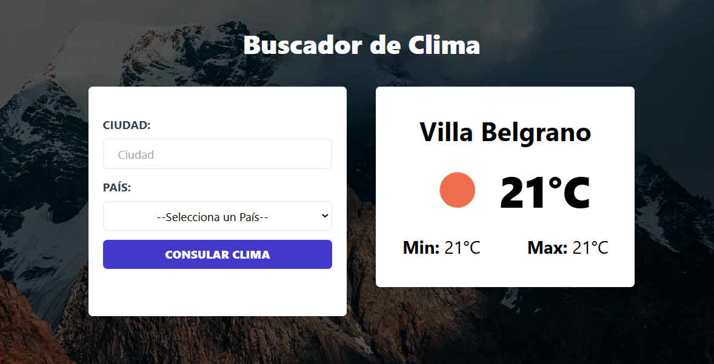

<!-- Banner -->


# 🌤️ Proyecto: App de Consulta del Clima

¡Bienvenido a mi proyecto! Esta es una aplicación web para consultar el clima de cualquier ciudad en tiempo real. La app utiliza la API de [OpenWeatherMap](https://openweathermap.org/) para obtener información meteorológica precisa y actualizada.

## 🛠️ Tecnologías Utilizadas

- **React**: Librería para construir interfaces de usuario.
- **Axios**: Cliente HTTP para realizar las peticiones a la API de OpenWeatherMap.
- **Tailwind CSS**: Framework de CSS para el estilizado de la aplicación.

## 🌐 Prueba la Aplicación

Puedes probar la aplicación en vivo en [este enlace de Netlify](https://tu-enlace-netlify.com).

## 📝 Funcionalidades Principales

- **Búsqueda de Clima por Ciudad**: Introduce el nombre de una ciudad para obtener su clima actual.
- **Visualización de Información Meteorológica**: Muestra la temperatura, descripción del clima, humedad, y otros detalles relevantes.
- **Actualización en Tiempo Real**: Cada consulta proporciona datos actualizados directamente desde la API de OpenWeatherMap.
- **Interfaz Intuitiva**: Diseño amigable y fácil de usar.

## 📂 Estructura del Proyecto

```bash
src/
├── components/       # Componentes reutilizables
├── data/             # Datos de los codigos de los paises
├── helpers/          # Funciones utilitarias y helpers
├── hooks/            # Configuración de Axios y lógica de conexión a la API
└── types/            # Types de TypeScript
```
## 🚀 Cómo Empezar
1. Clona el repositorio:

```bash
git clone https://github.com/RodrigoLoboDev/REST_API_FRONTEND-PRODUCTS
```
2. Instala las dependencias:

```bash
npm install
```

3. Inicia el servidor de desarrollo:

```bash
npm run dev
```

## 🤝 Contribuciones
Las contribuciones son bienvenidas. Si tienes ideas para mejorar el proyecto, no dudes en abrir un issue o hacer un pull request.

## 📧 Contacto
- Email: rolobo2812@gmail.com
- LinkedIn: [Jesús Luis Rodrigo Lobo](https://www.linkedin.com/in/jes%C3%BAs-luis-rodrigo-lobo-6594a81b4/)
- GitHub: [RodrigoLoboDev](https://github.com/RodrigoLoboDev)

#### ⭐️ Si te gusta lo que hago, no dudes en seguirme y contribuir a mis proyectos. ⭐️